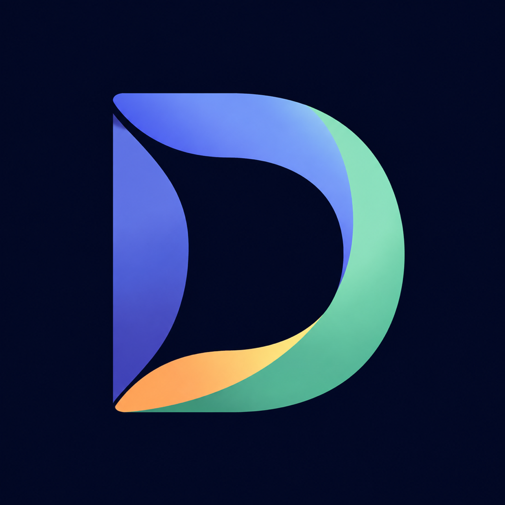
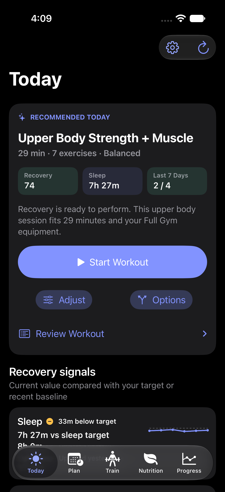
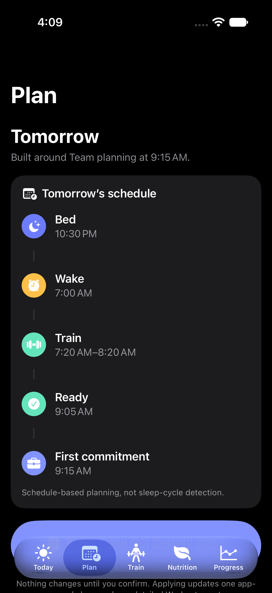
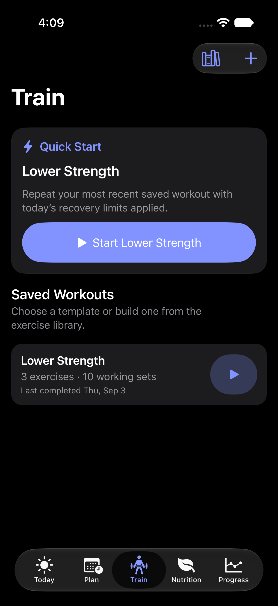
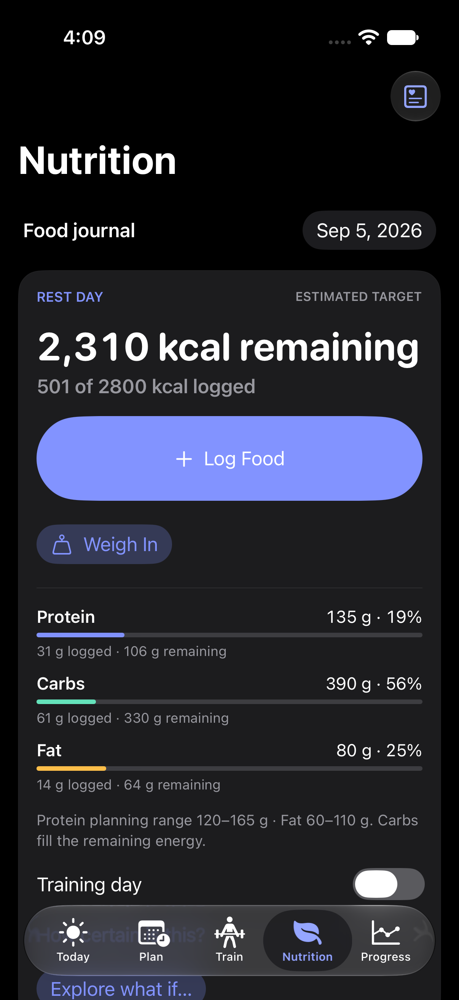
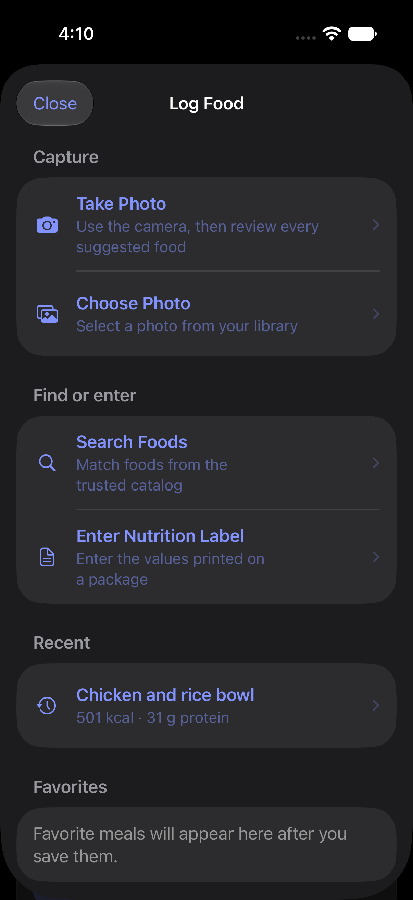
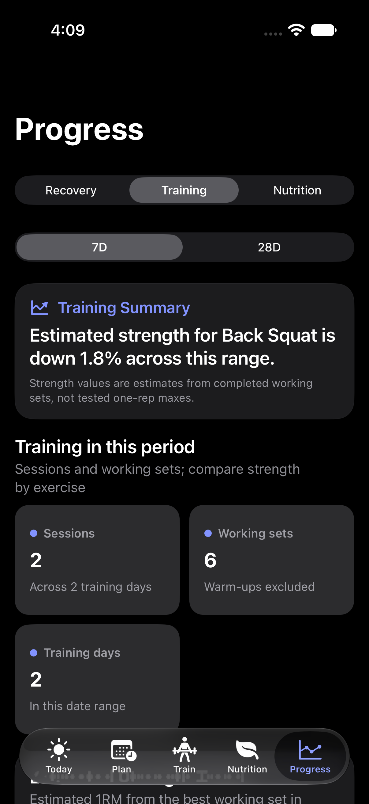
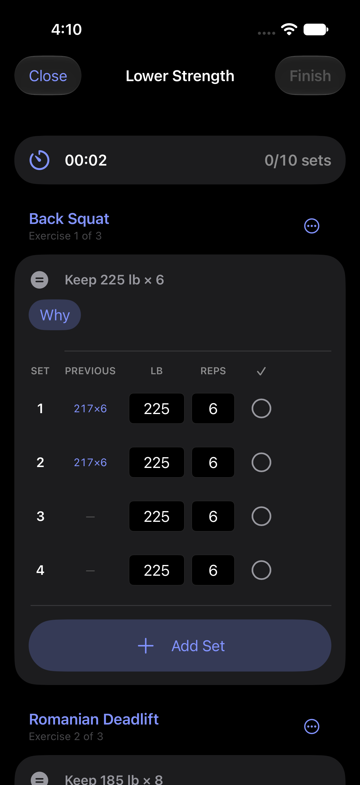
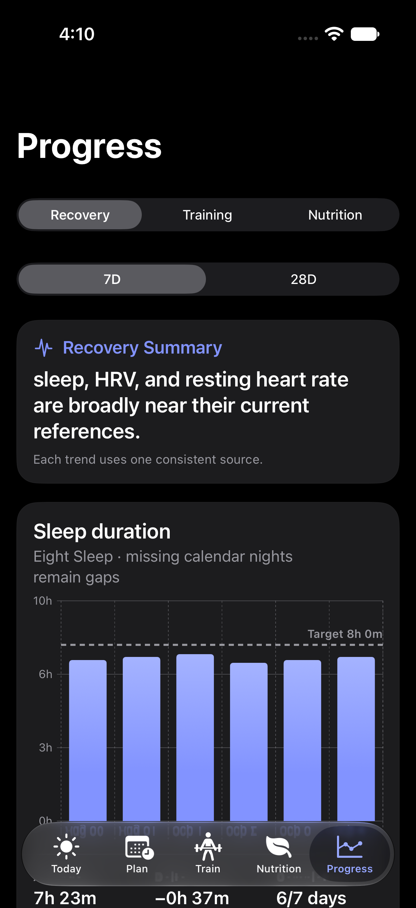
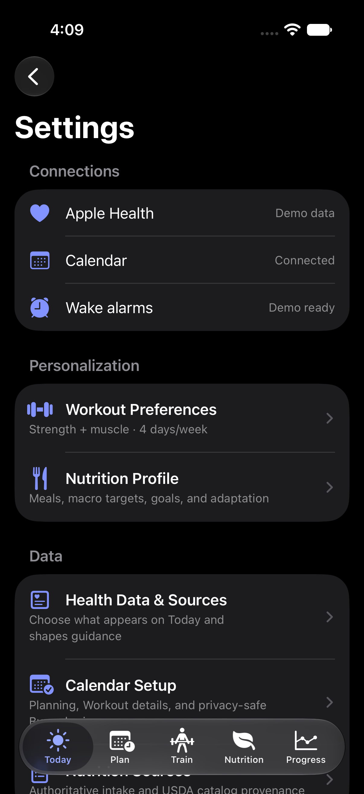

# Dayvera

**Build a stronger everyday.**

A private, local-first iOS app that helps you answer three connected questions:
how hard should I train, am I eating enough for my goal, and how well am I recovering?

  
  
  
  

  <a href="#-see-it-in-action"><strong>🎬 Tour</strong></a> ·
  <a href="#-how-it-works"><strong>✨ How it works</strong></a> ·
  <a href="#-run-it"><strong>🚀 Run it</strong></a> ·
  <a href="#-data--privacy"><strong>🔒 Data & privacy</strong></a> ·
  <a href="#-project-guides"><strong>📚 Guides</strong></a>

## What Dayvera helps you do

Training, food, sleep, and recovery are often tracked in separate places. Dayvera brings them into one daily decision without pretending that a wearable reading, calorie formula, or food photo is perfectly precise.

- **Today:** understand what matters now, start a recovery-aware workout, and see this week's rhythm without being punished for a missed day.
- **Plan:** work backward from tomorrow's first commitment and review exactly which alarm and Calendar items will be created before applying them.
- **Train:** start or resume a protected workout draft, follow reviewed exercises, and compare progress using clearly labeled estimates.
- **Nutrition:** estimate a bounded calorie and macro range, photograph or enter meals, confirm food matches and portions, and see what remains today.
- **Progress:** explore recovery, training, and nutrition trends with missing data, sources, units, and uncertainty kept visible.

Dayvera uses light motivation rather than rigid streaks: Weekly Rhythm reports completed training, confirmed nutrition days, and recorded recovery nights. It preserves progress when life interrupts a routine and welcomes returning users without guilt or artificial urgency.

## 🎬 See it in action

<strong>Decide → plan → train</strong>

  
  
  

See what matters today, understand tomorrow's schedule, and start or resume training with fewer decisions.

<strong>Fuel → review → adapt</strong>

  
  
  

Understand the target, choose the easiest trustworthy way to log food, and review trends before changing the plan.

<strong>Learn → review → trust</strong>

  
  
  

Current Penpot-aligned iOS 27 simulator captures use synthetic data, not personal health information. <a href="./QA/README.md">Open the full QA gallery and validation notes</a>.

## Nutrition and food logging

- Photograph food with Apple’s on-device image model, then match foods and review portions before saving.
- Search the bundled USDA catalog, add label values, repeat meals, or select one Apple Health dietary source per day.
- Build conservative calorie and macro targets for muscle gain, recomposition, maintenance, or fat loss.
- Review weight, intake, measurements, recovery, and gradual calorie suggestions.
- Explore what-if changes without altering your current target until you apply them.

Photo recognition is assistance, not an automatic calorie source. When the on-device capability is available, it suggests possible foods and rough portions. You still choose a trusted catalog match, correct the portion, add missed ingredients such as oils or sauces, and review the meal before saving. Manual food search and label entry remain available when recognition is unavailable. Read the [calculation methodology and evidence](NUTRITION.md) and [rebrand compatibility notes](REBRAND.md).

## ✨ How it works

`Eight Sleep / Hume / Apple Watch → Apple Health → Dayvera`

- **Read:** normalize 16 Apple Health types across recovery, safety, training, and body context; inspect every source observed in the current Health window.
- **Decide:** build three validated daily workout options from recovery, training history, goals, available time, equipment, and exclusions.
- **Plan:** work backward from tomorrow’s commitments, save full workout details to one calendar, and add optional privacy-safe “Busy” copies to others. [See Calendar Setup](./QA/Screenshots/dayvera-final-calendar-setup-dark.png).
- **Train:** build templates from an illustrated exercise catalog; log previous performance, load, reps, completed sets, safe progression cues, rest time, and resumable drafts.
- **Nutrition:** compare an estimated target with reviewed intake, keep one authoritative source per day, and use complete days plus weight observations as evidence for gradual changes that you explicitly accept.
- **Progress:** compare 7- or 28-day recovery trends, training sessions, working sets, estimated 1RM trends and bests, and provenance-aware body measurements.

Dayvera reads only what compatible apps write to Apple Health. Vendor-only
Eight Sleep or Hume scores remain unavailable, and the app never calls their
private APIs. Alarms and Calendar events are created or replaced only after
confirmation; Undo removes only app-created entries.

Dayvera's assistive features solve two narrow problems while keeping the user in control:

- **Choosing among safe workout options:** the deterministic planner first creates three valid candidates from reviewed exercises and hard safety rules. Optional on-device assistance may rank those candidates and improve the explanation. It cannot invent an exercise, change an exclusion, or relax a recovery or volume boundary.
- **Reducing food-entry work:** on-device photo analysis may suggest food names and rough portions. Nutrients come only from the reviewed USDA catalog match, a package label, a manual value, or the selected supported Health source. A photo never saves a meal by itself.

Both features fall back to a complete manual path. Dayvera does not create a long-range periodized program or apply suggested weight or calorie changes automatically.

## 🚀 Run it

Requires **Xcode 27+** and an **iOS 27** simulator or iPhone.
Dayvera is not distributed through the App Store yet, so install it from
source with Xcode.

### Install on your iPhone

1. Clone this repository, then open `Dayvera.xcodeproj` in Xcode.
2. Connect and unlock your iPhone. Tap **Trust** on the phone if macOS asks.
3. In Xcode, select **Dayvera → Dayvera target → Signing & Capabilities**. Keep **Automatically manage signing** enabled and choose your Personal Team. If no team appears, add your Apple Account under **Xcode → Settings → Accounts**.
4. When updating an existing installation, keep its bundle identifier and signing team. For a separate personal fork, use a unique identifier such as `com.yourname.dayvera`; this creates a separate app and data container.
5. Choose your iPhone in the run-destination menu and press **Run** (`⌘R`). Enable **Developer Mode** on the phone if iOS prompts for it, then run once more.
6. If iOS blocks the first launch, open **Settings → General → VPN & Device Management**, select the developer identity, and tap **Trust**.
7. In Dayvera, review the Apple Health categories first. Each iPhone grants Health access separately; Calendar and alarm access remain optional until used.

Apple’s [run-on-device guide](https://developer.apple.com/documentation/xcode/running-your-app-on-simulated-or-physical-devices)
covers signing and provisioning troubleshooting.

To preview without a phone, choose an iOS 27 simulator and press **Run**. HealthKit
does not provide real wearable samples there, so use the
[demo launch arguments](DEVELOPMENT.md#deterministic-simulator-states) for the
sample states shown above.

For repeatable demo states, tests, and command-line builds, use the
[developer guide](DEVELOPMENT.md).

> [!NOTE]
> Simulator QA covers the interface and app logic. Real HealthKit sources,
> permission sheets, Calendar writes, and AlarmKit delivery require an iPhone.
> Xcode manages the development profile locally; do not commit Apple account,
> team, certificate, provisioning-profile, or device identifiers. Free Personal
> Team installs are temporary and typically need to be rebuilt every seven days.

## 🔒 Data & privacy

- Dayvera processes health signals locally and has no app-managed cloud sync.
- No Dayvera account, app-managed server, ads, or analytics SDK.
- Health and workout data are never attached to exercise-catalog requests.
- Finished workouts save locally first; Apple Health write access is requested only when you complete a session.
- Recommendation confidence describes available inputs—not medical certainty or wearable accuracy.
- Estimated maintenance calories, macro ranges, photo portions, recovery guidance, and estimated 1RM remain labeled as estimates; measured and user-confirmed values retain their sources.

Dayvera is wellness software, not medical advice. See the
[privacy policy](PRIVACY.md) and [security notes](SECURITY.md).

## 📚 Project guides

| Guide | What it contains |
| :--- | :--- |
| [Architecture](ARCHITECTURE.md) | Existing stack, nutrition integration, schema and file map |
| [Nutrition methodology](NUTRITION.md) | Formulas, uncertainty, adaptation and evidence |
| [Rebrand compatibility](REBRAND.md) | Identity and data continuity |
| [QA gallery](QA/README.md) | Dark, light, compact-width, and accessibility captures |
| [Developer guide](DEVELOPMENT.md) | Build, test, and deterministic demo commands |
| [Implementation status](IMPLEMENTATION_STATUS.md) | Verified behavior and remaining device acceptance |
| [UX flow contract](UX_REDESIGN_HANDOFF.md) | Screen ownership, flows, and acceptance criteria |
| [Security](SECURITY.md) | Repository hygiene and local-data hardening |
| [Privacy policy](PRIVACY.md) | What the app reads, stores, writes, and never sends |

Exercise content and illustrations are fetched at runtime from
[RepDB](https://repdb.co) under its
[dataset terms](https://github.com/RepDB/exercise-dataset/blob/main/LICENSE-DATA.md)
and are not redistributed in this repository. See
[third-party notices](THIRD_PARTY_NOTICES.md). Catalog media currently provides
Start/Finish illustrations rather than full-motion exercise video.
