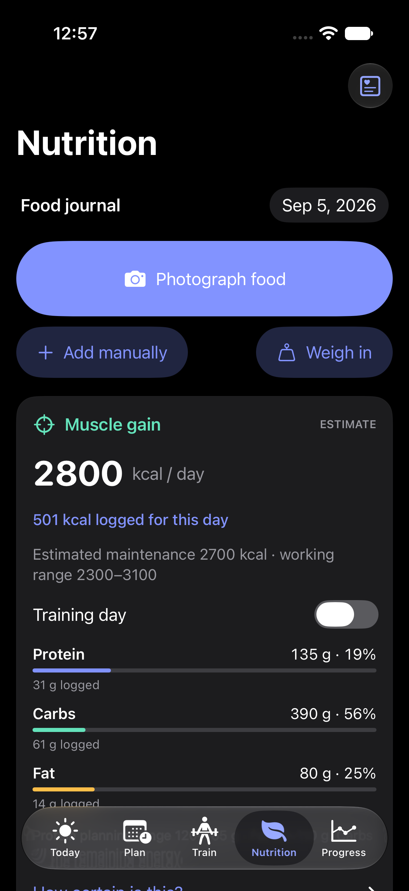
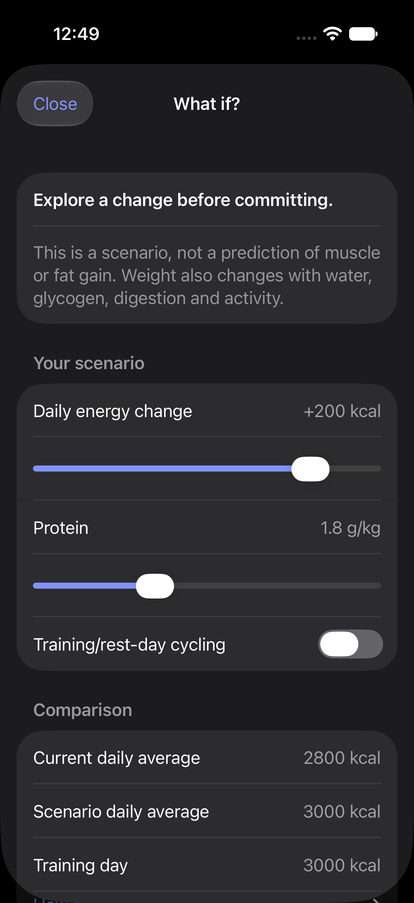
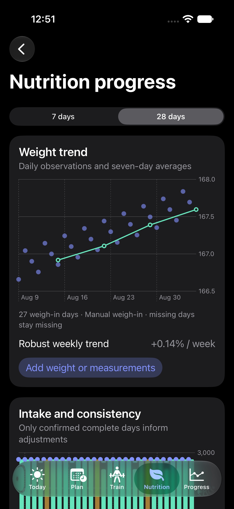
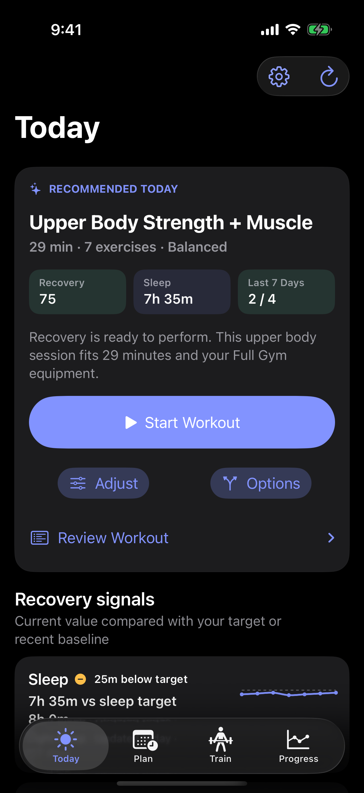
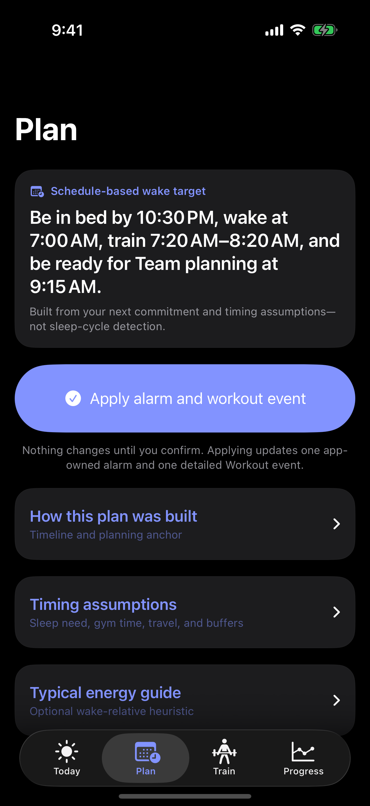
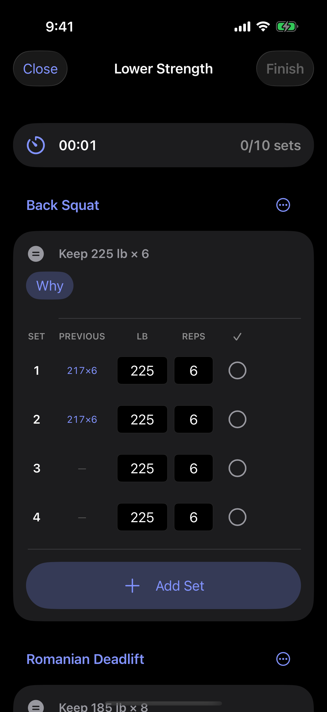
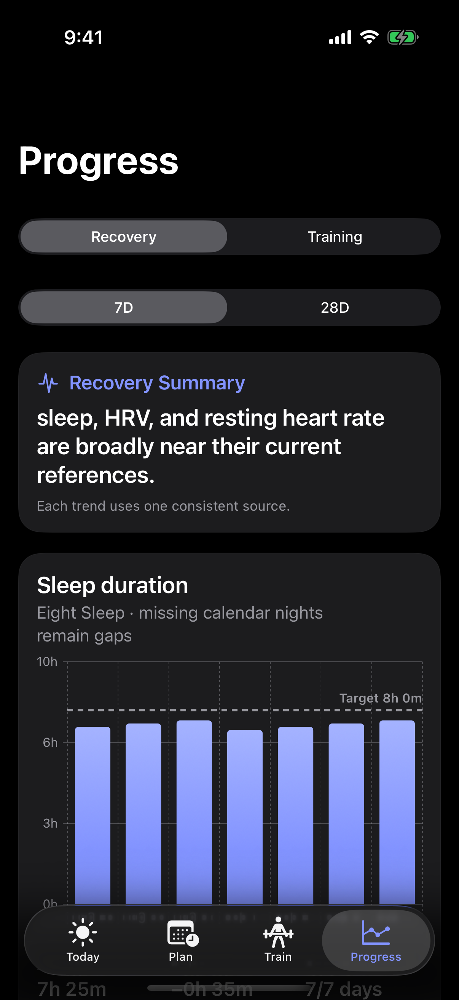

# Dayvera

**Build a stronger everyday.**

A private, local-first iOS app that connects training, nutrition, and recovery.
Photograph meals, review portions, plan macros, and train with Apple Health context.

  
  
  
  

  <a href="#-see-it-in-action"><strong>🎬 Tour</strong></a> ·
  <a href="#-how-it-works"><strong>✨ How it works</strong></a> ·
  <a href="#-run-it"><strong>🚀 Run it</strong></a> ·
  <a href="#-data--privacy"><strong>🔒 Data & privacy</strong></a> ·
  <a href="#-project-guides"><strong>📚 Guides</strong></a>

## 🎬 See it in action

<strong>Fuel → review → adapt</strong>

  
  
  

Current iOS 27 captures with synthetic data. Review portions, keep uncertainty visible, and apply changes deliberately.

<strong>Decide → plan → train</strong>

  
  
  

Know how hard to train, work backward from tomorrow, then log a prepared workout.

<strong>Learn → review → trust</strong>

  
  
  

Historical recovery/training captures from the pre-nutrition build with deterministic simulator data—not personal health information. <a href="./QA/README.md">Open the full QA gallery</a>.

## Nutrition and food logging

- Photograph food with Apple’s on-device image model, then match foods and review portions before saving.
- Search the bundled USDA catalog, add label values, repeat meals, or select one Apple Health dietary source per day.
- Build conservative calorie and macro targets for muscle gain, recomposition, maintenance, or fat loss.
- Review weight, intake, measurements, recovery, and gradual calorie suggestions.
- Explore what-if changes without altering your current target until you apply them.

Photo recognition requires an available image-capable Apple Intelligence model; manual logging works when it is unavailable. Read the [calculation methodology and evidence](NUTRITION.md) and [rebrand compatibility notes](REBRAND.md).

## ✨ How it works

`Eight Sleep / Hume / Apple Watch → Apple Health → Dayvera`

- **Read:** normalize 16 Apple Health types across recovery, safety, training, and body context; inspect every source observed in the current Health window.
- **Decide:** build three validated daily workout options from recovery, training history, goals, available time, equipment, and exclusions.
- **Plan:** work backward from tomorrow’s commitments, save full workout details to one calendar, and add optional privacy-safe “Busy” copies to others. [See Calendar Setup](./QA/Screenshots/dayvera-final-calendar-setup-dark.png).
- **Train:** build templates from an illustrated exercise catalog; log previous performance, load, reps, completed sets, safe progression cues, rest time, and resumable drafts.
- **Progress:** compare 7- or 28-day recovery trends, training sessions, working sets, estimated 1RM trends and bests, and provenance-aware body measurements.

Dayvera reads only what compatible apps write to Apple Health. Vendor-only
Eight Sleep or Hume scores remain unavailable, and the app never calls their
private APIs. Alarms and Calendar events are created or replaced only after
confirmation; Undo removes only app-created entries.

Dayvera first reduces the enabled Apple Health signals and local workout
history into a bounded daily state. A deterministic planner then chooses only
reviewed catalog exercises, enforces recovery and volume limits, and creates a
recommended, shorter, and alternate-focus workout. When supported and explicitly
enabled, on-device personalization may rank those three valid options and improve
the explanation; deterministic planning remains available when the model is
unavailable or low-power or thermal conditions block personalization. It cannot
invent exercises or change safety rules. The app does not yet create a long-range
periodized program or apply suggested weight increases automatically.

## 🚀 Run it

Requires **Xcode 27+** and an **iOS 27** simulator or iPhone.
Dayvera is not distributed through the App Store yet, so install it from
source with Xcode.

### Install on your iPhone

1. Clone this repository, then open `Dayvera.xcodeproj` in Xcode.
2. Connect and unlock your iPhone. Tap **Trust** on the phone if macOS asks.
3. In Xcode, select **Dayvera → Dayvera target → Signing & Capabilities**. Keep **Automatically manage signing** enabled and choose your Personal Team. If no team appears, add your Apple Account under **Xcode → Settings → Accounts**.
4. When updating an existing installation, keep its bundle identifier and signing team. For a separate personal fork, use a unique identifier such as `com.yourname.dayvera`; this creates a separate app and data container.
5. Choose your iPhone in the run-destination menu and press **Run** (`⌘R`). Enable **Developer Mode** on the phone if iOS prompts for it, then run once more.
6. If iOS blocks the first launch, open **Settings → General → VPN & Device Management**, select the developer identity, and tap **Trust**.
7. In Dayvera, review the Apple Health categories first. Each iPhone grants Health access separately; Calendar and alarm access remain optional until used.

Apple’s [run-on-device guide](https://developer.apple.com/documentation/xcode/running-your-app-on-simulated-or-physical-devices)
covers signing and provisioning troubleshooting.

To preview without a phone, choose an iOS 27 simulator and press **Run**. HealthKit
does not provide real wearable samples there, so use the
[demo launch arguments](DEVELOPMENT.md#deterministic-simulator-states) for the
sample states shown above.

For repeatable demo states, tests, and command-line builds, use the
[developer guide](DEVELOPMENT.md).

> [!NOTE]
> Simulator QA covers the interface and app logic. Real HealthKit sources,
> permission sheets, Calendar writes, and AlarmKit delivery require an iPhone.
> Xcode manages the development profile locally; do not commit Apple account,
> team, certificate, provisioning-profile, or device identifiers. Free Personal
> Team installs are temporary and typically need to be rebuilt every seven days.

## 🔒 Data & privacy

- Dayvera processes health signals locally and has no app-managed cloud sync.
- No Dayvera account, app-managed server, ads, or analytics SDK.
- Health and workout data are never attached to exercise-catalog requests.
- Finished workouts save locally first; Apple Health write access is requested only when you complete a session.
- Recommendation confidence describes available inputs—not medical certainty or wearable accuracy.

Dayvera is wellness software, not medical advice. See the
[privacy policy](PRIVACY.md) and [security notes](SECURITY.md).

## 📚 Project guides

| Guide | What it contains |
| :--- | :--- |
| [Architecture](ARCHITECTURE.md) | Existing stack, nutrition integration, schema and file map |
| [Nutrition methodology](NUTRITION.md) | Formulas, uncertainty, adaptation and evidence |
| [Rebrand compatibility](REBRAND.md) | Identity and data continuity |
| [QA gallery](QA/README.md) | Dark, light, compact-width, and accessibility captures |
| [Developer guide](DEVELOPMENT.md) | Build, test, and deterministic demo commands |
| [Implementation status](IMPLEMENTATION_STATUS.md) | Verified behavior and remaining device acceptance |
| [UX flow contract](UX_REDESIGN_HANDOFF.md) | Screen ownership, flows, and acceptance criteria |
| [Security](SECURITY.md) | Repository hygiene and local-data hardening |
| [Privacy policy](PRIVACY.md) | What the app reads, stores, writes, and never sends |

Exercise content and illustrations are fetched at runtime from
[RepDB](https://repdb.co) under its
[dataset terms](https://github.com/RepDB/exercise-dataset/blob/main/LICENSE-DATA.md)
and are not redistributed in this repository. See
[third-party notices](THIRD_PARTY_NOTICES.md). Catalog media currently provides
Start/Finish illustrations rather than full-motion exercise video.
