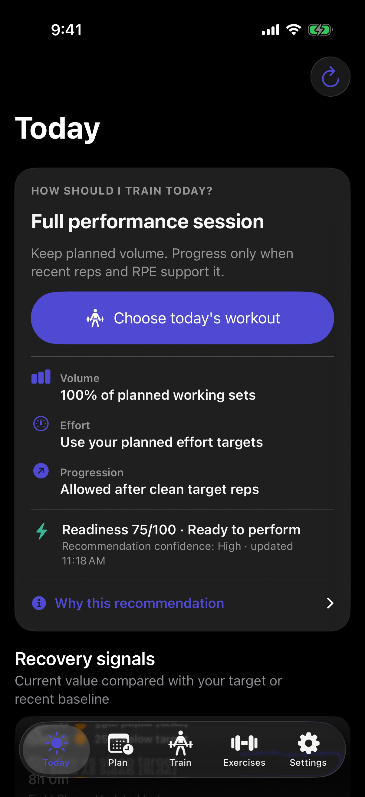
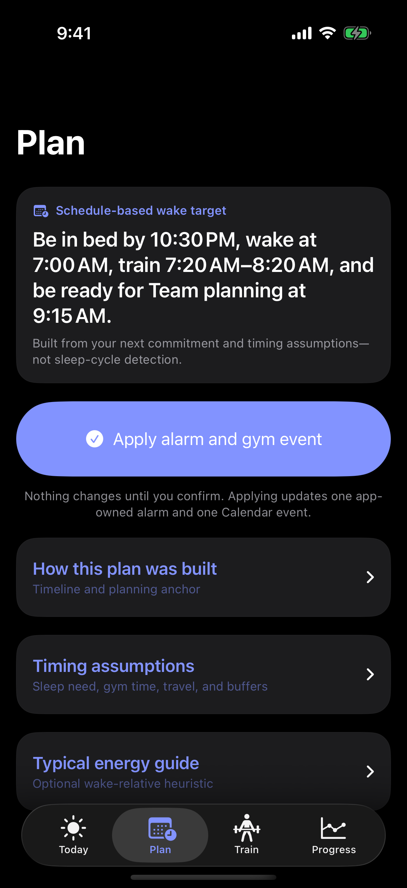
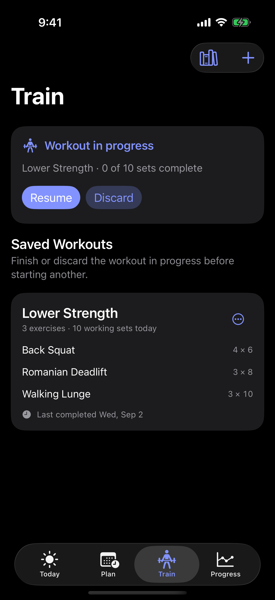
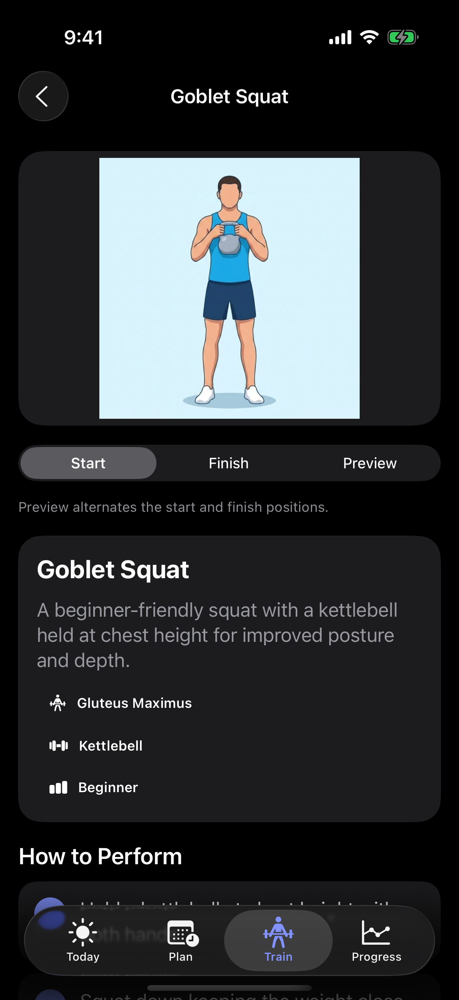
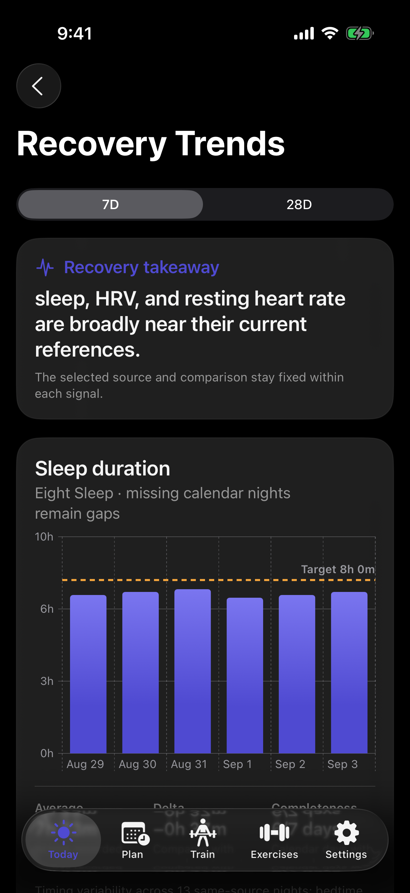
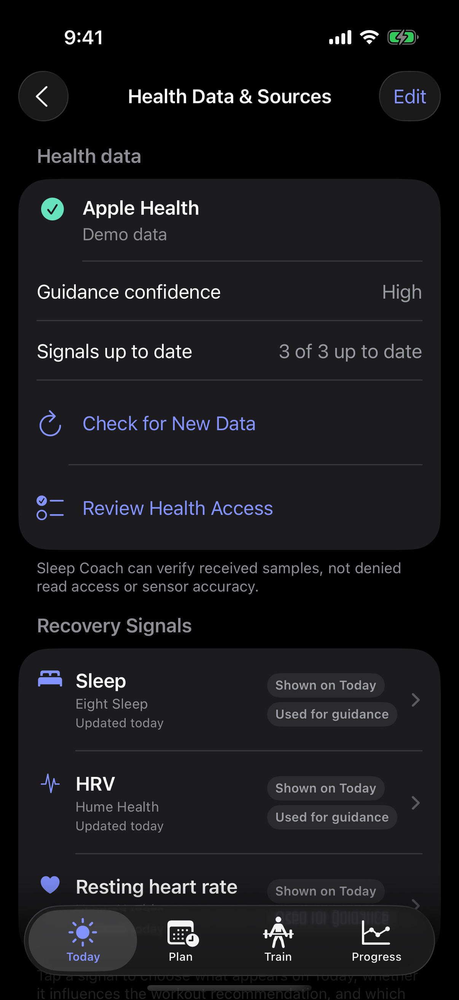

# Sleep Coach

**Wake with a plan. Train with context.**

A private, local-first iOS app that turns Apple Health recovery signals into an
explainable workout recommendation and morning schedule.

  
  
  
  

  <a href="#-see-it-in-action"><strong>🎬 Tour</strong></a> ·
  <a href="#-how-it-works"><strong>✨ How it works</strong></a> ·
  <a href="#-run-it"><strong>🚀 Run it</strong></a> ·
  <a href="#-data--privacy"><strong>🔒 Data & privacy</strong></a> ·
  <a href="#-project-guides"><strong>📚 Guides</strong></a>

## 🎬 See it in action

<strong>Decide → plan → train</strong>

  
  
  

Know how hard to train, work backward from tomorrow, then start a prepared workout.

<strong>Learn → review → trust</strong>

  
  
  

Simulator captures use deterministic demo data—not personal health information. <a href="./QA/README.md">Open the full QA gallery</a>.

## ✨ How it works

`Eight Sleep / Hume / Apple Watch → Apple Health → Sleep Coach`

- **Read:** core recovery, safety, activity, workout, and body-context signals, with every observed source kept visible.
- **Decide:** build three validated daily workout options from recovery, training history, goals, time, equipment, and exclusions.
- **Plan:** suggest bedtime, wake time, and gym time across selected calendars; save full details to one calendar and optional privacy-safe “Busy” copies to others.
- **Train:** build templates from an illustrated exercise catalog, then log previous performance, load, reps, completed sets, and rest time.

Sleep Coach reads what compatible apps write to Apple Health; it does not call
private Eight Sleep or Hume APIs. Alarms and Calendar events change only after
confirmation.

Sleep Coach first reduces the enabled Apple Health signals and local workout
history into a bounded daily state. A deterministic planner then chooses only
reviewed catalog exercises, enforces recovery and volume limits, and creates a
recommended, shorter, and alternate-focus workout. Optional on-device
personalization may rank those three valid options and improve the explanation;
it cannot invent exercises or change safety rules. The app does not yet create a
long-range periodized program or apply suggested weight increases automatically.

## 🚀 Run it

Requires **Xcode 26+** and an **iOS 26** simulator or iPhone.
Sleep Coach is not distributed through the App Store yet, so install it from
source with Xcode.

### Install on your iPhone

1. Clone this repository, then open `SleepCoach.xcodeproj` in Xcode.
2. Connect and unlock your iPhone. Tap **Trust** on the phone if macOS asks.
3. In Xcode, select **SleepCoach → SleepCoach target → Signing & Capabilities**. Keep **Automatically manage signing** enabled and choose your Personal Team.
4. If Xcode says the identifier is unavailable, change **Bundle Identifier** to something unique, such as `com.yourname.sleepcoach`.
5. Choose your iPhone in the run-destination menu and press **Run** (`⌘R`). Enable **Developer Mode** on the phone if iOS prompts for it, then run once more.
6. In Sleep Coach, review the Apple Health categories first. Calendar and alarm access remain optional until you use those features.

Apple’s [run-on-device guide](https://developer.apple.com/documentation/xcode/running-your-app-on-simulated-or-physical-devices)
covers signing and provisioning troubleshooting.

To preview without a phone, choose an iOS 26 simulator and press **Run**. HealthKit
does not provide real wearable samples there, so use the
[demo launch arguments](DEVELOPMENT.md#deterministic-simulator-states) for the
sample states shown above.

For repeatable demo states, tests, and command-line builds, use the
[developer guide](DEVELOPMENT.md).

> [!NOTE]
> Simulator QA covers the interface and app logic. Real HealthKit sources,
> permission sheets, Calendar writes, and AlarmKit delivery require an iPhone.
> Xcode manages the development profile locally; do not commit Apple account,
> team, certificate, provisioning-profile, or device identifiers.

## 🔒 Data & privacy

- Sleep Coach processes health signals locally and has no app-managed cloud sync.
- No Sleep Coach account, app-managed server, ads, or analytics SDK.
- Health and workout data are never attached to exercise-catalog requests.
- Finished workouts save locally first; Apple Health write access is requested only when you complete a session.
- Recommendation confidence describes available inputs—not medical certainty or wearable accuracy.

Sleep Coach is wellness software, not medical advice. See the
[privacy policy](PRIVACY.md) and [security notes](SECURITY.md).

## 📚 Project guides

| Guide | What it contains |
| :--- | :--- |
| [QA gallery](QA/README.md) | Dark, light, compact-width, and accessibility captures |
| [Developer guide](DEVELOPMENT.md) | Build, test, and deterministic demo commands |
| [Implementation status](IMPLEMENTATION_STATUS.md) | Verified behavior and remaining device acceptance |
| [UX flow contract](UX_REDESIGN_HANDOFF.md) | Screen ownership, flows, and acceptance criteria |
| [Security](SECURITY.md) | Repository hygiene and local-data hardening |
| [Privacy policy](PRIVACY.md) | What the app reads, stores, writes, and never sends |

Exercise content and illustrations are fetched at runtime from
[RepDB](https://repdb.co) under its
[dataset terms](https://github.com/RepDB/exercise-dataset/blob/main/LICENSE-DATA.md)
and are not redistributed in this repository. See
[third-party notices](THIRD_PARTY_NOTICES.md).
